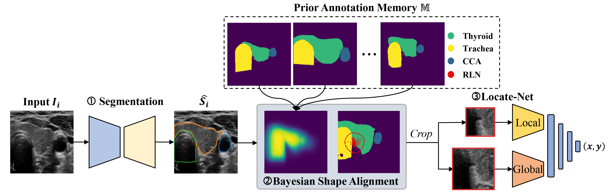

# RLNLocalization
This repository is the implementation of the cascaded network for Recurrent Laryngeal Nerve Localization by Haoran Dou in CISTIB at University of Leeds.

**Localizing the Recurrent Laryngeal Nerve via Ultrasound with a Bayesian Shape Framework.**  
*Haoran Dou, Luyi Han, Yushuang He, Jun Xu, Nishant Ravikumar, Ritse Mann, Alejandro F. Frangi, Pew-Thian Yap, Yunzhi Huang.*  
International Conference on Medical Image Computing and Computer Assisted Intervention, 2022.

> Tumor infiltration of the recurrent laryngeal nerve (RLN) is a contraindication for robotic thyroidectomy and can be difficult to detect via standard laryngoscopy. Ultrasound (US) is a viable alternative for RLN detection due to its safety and ability to provide real-time feedback. However, the tininess of the RLN, with a diameter typically less than 3,mm, poses significant challenges to the accurate localization of the RLN. In this work, we propose a knowledge-driven framework for RLN localization, mimicking the standard approach surgeons take to identify the RLN according to its surrounding organs. We construct a prior anatomical model based on the inherent relative spatial relationships between organs. Through Bayesian shape alignment (BSA), we obtain the candidate coordinates of the center of a region of interest (ROI) that encloses the RLN. The ROI allows a decreased field of view for determining the refined centroid of the RLN using a dual-path identification network, based on multi-scale semantic information. Experimental results indicate that the proposed method achieves superior hit rates and substantially smaller distance errors compared with state-of-the-art methods. 

## Usage

